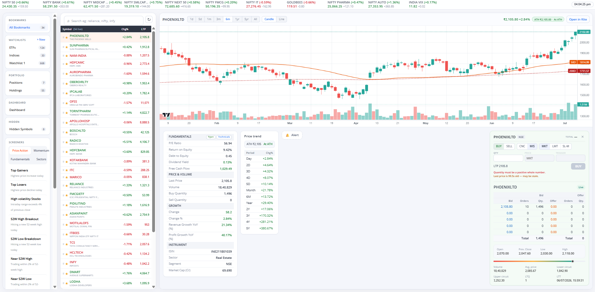
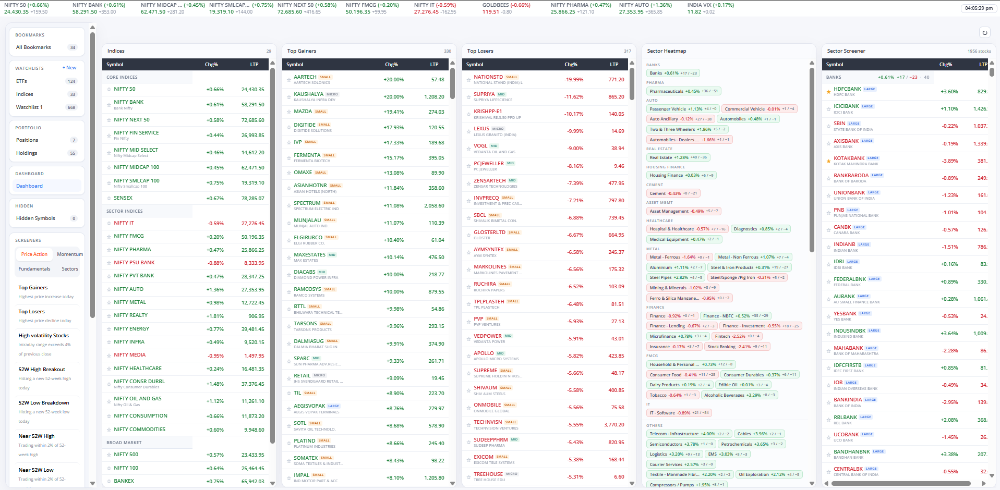
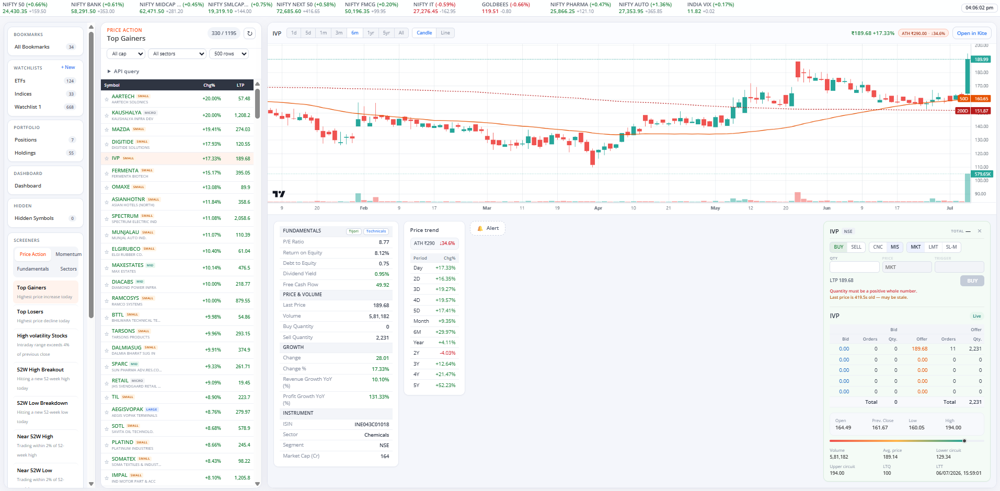

# Kite Local Screener

Chrome extension + React screener injected into Kite at `https://kite.zerodha.com/local-screener`.



Watchlists, screeners, live charts, fundamentals, market depth, and order placement — inside your existing Kite session.

## Screenshots

### Dashboard
Indices, top gainers/losers, sector heatmap, and sector screener in one view.



### Top gainers screener
Screener results with chart, fundamentals, price trend, and trade panel.



### Stock detail
Chart, fundamentals, depth, and order ticket for a selected symbol.


## Layout

- `kite-screener/` — React app source
- `kite-cors-helper/` — Chrome extension (build output in `app/`)

## Build

```bash
cd kite-screener
npm install
npm run build:extension
```

Reload the extension from `chrome://extensions` (load unpacked → `kite-cors-helper`).

## Use

1. Log in to Kite in Chrome
2. Open `https://kite.zerodha.com/local-screener`

Uses your existing Kite session — no API keys or cookie paste required.
